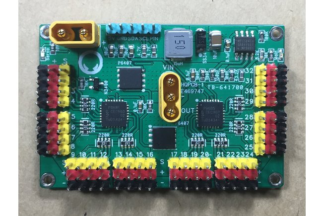

### Fuzzy-32-Servo-Lord
This is a arduino library for [Fuzzy 32-Channel Servo Controller](https://www.tindie.com/products/FuzzyStudio/32-channel-servo-controller-pca9685-for-arduino/) based on two PCA9685 ICs. That is, the "**dual**" version of the original [Adafruit servo board](https://www.adafruit.com/product/815).

- Onboard MOSFET as power relay to turn servo power on/off using an Arduino, adds another layer of protection
- Onboard 5V buck regulator, voltage input range 6V to 28V, up to 3A continuous output current, can be used to provide 5V supply to external systems
- Reverse polarity protection
 -Comes with Amass plugs, 30A current rating, easy to plug and unplug
- Comes with power on/off button (this is rated 250VAC 10A, so might need to swap bigger switch for high current applications
- 4cm x 6cm

#### The Library
This library uses I2C protocol to communicate with two PCA9685 chips. The I2C slave addresses are fixed at
- 0x40 : Chip 1, left side, for channel 1-16
- 0x41 : Chip 2, right side, for channel 17-32

In the code, servo channel number starts from 1, as labeled on the board. With this library, users can easily command any or all servos at once, turn off the signal line (retaining servo power), and then turn on the signal line with last commanded positions.

More importantly, this library are re-coded with the needs of [internal oscillator calibration](https://github.com/adafruit/Adafruit-PWM-Servo-Driver-Library/issues/40) and variable servo update frequency in mind. Due to the inaccurate 
nature of the internal oscillator, the PCA9685 core frequency may be as much as 5%~10% off and differs chip by chip. So each chip needs to be calibrated if higher degree of accuracy is desired for robotic projects.

Once the core frequencies are obtained, users may use this method in later sketches.
For example: 

`ServoController.setClockFrequency(27102244, 27380892);`

#### Examples

##### - Sweep
This example demonstrates how to command servos back and forth, using PWM length (700~2300 microseconds).

##### - Control Servo Via Potentiometer
This example demonstrates how to command servo positions using a 3-pin potentiometer.

##### - Chip Frequency Calibrator
This example calibrates the PC9685 core frequency **using your own arduino board**, which is clocked by external crystal oscillators that are far more accurate (typical 0.002%) than internal RC oscillators.

Just connect two extra feedback wires and run the sketch. Calibration progress will be shown on the Serial Window. After one-time calibration, the output signal may reach +- 1 _us_ (microsecond) accuracy at higher update frequency (~150 Hz or above, see notes below).

#### Update Frequency and Resolution

Achievable value range for update frequency is 24 to 1526 Hz. according to the datasheet. A classic servo runs at 50 Hz, and the resolution is around 4.88us at this update frequency. Increase the update frequency reduce both the response time and resolution, however, if the update frequency goes too high, the servo might shake or stop working. 
	
Here are the approximate values for some update frequencies (refresh rate):

|Update frequency| Period        | Resolution  |
| -------------- |:-------------:| -----------:|
| 50    Hz.      |20    ms.      |4.88 us.     |
| 60    Hz.      |16.67 ms.      |4.07 us.     |
|100    Hz.      |10    ms.      |2.71 us.     |
|122.07 Hz.      |8.19  ms.     |2.00 us.     |
|150    Hz.      |6.67  ms.      |1.63 us.     |
|200    Hz.      |5    ms.       |1.22 us.     |
|244.14 Hz.      |4.1   ms.      |1.00 us.     |

In PCA9685 chip, update frequency and resolution are always interconnected. Desired update frequency can be set in code using the `setUpdateFrequency(float)` method. The actual output frequency would not exactly match the target frequency due to pre-scaling. However, it is not the frequency but the **pulse width** that really matters in PWM servo control.

#### Calbration

The following inaccuracy sources are identified and mitigated in order to obtain +-1  _us_ accuracy:

- Inaccuracy of the internal RC oscillator
- The **rounding** mathematics of the pre-scaler and update frequency
- The difference between **target update frequency** and **actual update frequency** due to oscillator clock error and pre-scaling
- The resolution determined by the update frequency and chip design (12-bit, 4096 steps per cycle)
- The temperature that affects RC oscillator

The signals are confirmed by an USB based oscilloscope in this project. Refer to the comments in the library for further details.

